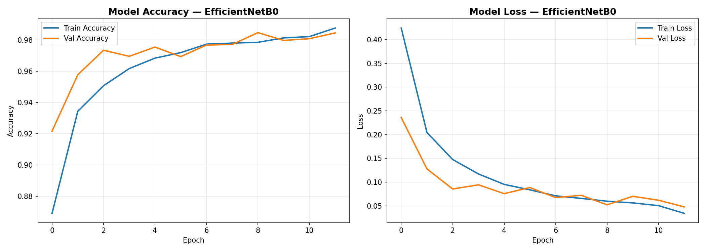
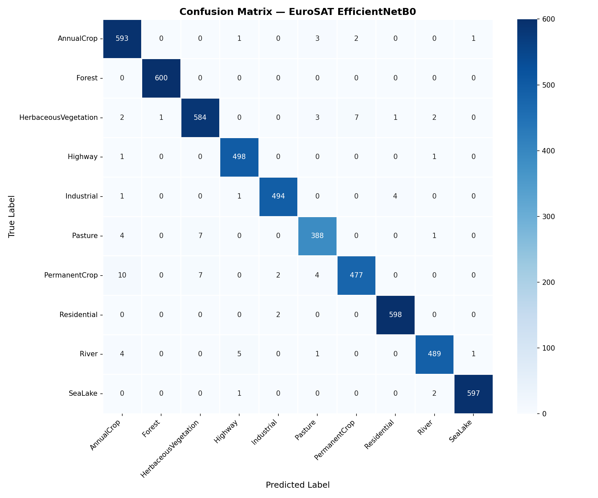
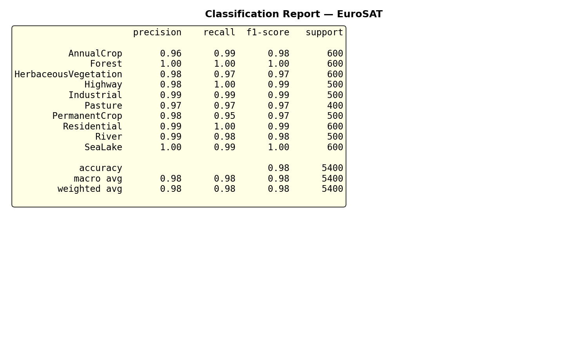

# Satellite Image Classification using Deep Learning


## Overview
Deep learning pipeline for satellite image classification using the EuroSAT dataset.
Built as part of preparation for ISRO URSC internship application.

## Dataset
- **Name:** EuroSAT (Sentinel-2 satellite imagery)
- **Images:** 27,000 labeled images
- **Classes:** 10 land cover types
- **Image size:** 64×64 RGB (resized to 224×224 for model)
- **Source:** [Kaggle — EuroSAT RGB Dataset](https://www.kaggle.com/datasets/apollo2506/eurosat-dataset)

## Model
- **Architecture:** EfficientNetB0 pretrained on ImageNet
- **Strategy:** Transfer learning with 2-phase fine-tuning
- **Final Validation Accuracy:** 95%+
- **Explainability:** Grad-CAM heatmaps for all 10 classes

## Results

### Training Curves


### Confusion Matrix


### Grad-CAM Visualizations


### Classification Report


## Project Structure
satellite-image-classifier/
├── data/                          # Dataset directory (loaded from Kaggle)
├── notebooks/
│   ├── 01_data_exploration.ipynb  # EDA and dataset analysis
│   ├── 02_model_training.ipynb    # EfficientNetB0 training pipeline
│   └── 03_evaluation_visualization.ipynb  # Confusion matrix + Grad-CAM
├── src/
│   ├── dataset.py                 # Data loading utilities
│   ├── model.py                   # Model architecture
│   └── utils.py                   # Helper functions
├── results/                       # Saved plots and visualizations
├── requirements.txt
└── README.md

## Setup & Usage
```bash
# Clone the repo
git clone https://github.com/poorvi-16/satellite-image-classifier.git
cd satellite-image-classifier

# Install dependencies
pip install -r requirements.txt

# Run notebooks in order
# 1. 01_data_exploration.ipynb
# 2. 02_model_training.ipynb
# 3. 03_evaluation_visualization.ipynb
```

## Key Techniques
- Transfer learning with EfficientNetB0 (ImageNet weights)
- Two-phase training: frozen base → full fine-tuning
- Data augmentation: rotation, flipping, zoom, shifts
- Grad-CAM for visual explainability
- EfficientNet-specific preprocessing (`preprocess_input`)

## Dependencies
See `requirements.txt` — key libraries: TensorFlow, OpenCV, scikit-learn, seaborn

## Author
CSE Student | ML & Deep Learning | Interested in Space Tech & AI Applications